```{r setup, include = FALSE}
# Setup chunk
# Paquetes a usar
#options(htmltools.dir.version = FALSE) cambia la forma de incluir código, los colores

library(knitr)
library(tidyverse)
library(xaringanExtra)
library(icons)
library(fontawesome)
library(emo)

# set default options
opts_chunk$set(collapse = TRUE,
               dpi = 300,
               warning = FALSE,
               error = FALSE,
               comment = "#")

top_icon = function(x) {
  icons::icon_style(
    icons::fontawesome(x),
    position = "fixed", top = 10, right = 10
  )
}

knit_engines$set("yaml", "markdown")

# Con la tecla "O" permite ver todas las diapositivas
xaringanExtra::use_tile_view()
# Agrega el boton de copiar los códigos de los chunks
xaringanExtra::use_clipboard()

# Crea paneles impresionantes 
xaringanExtra::use_panelset()

# Para compartir e incrustar en otro sitio web
xaringanExtra::use_share_again()
xaringanExtra::style_share_again(
  share_buttons = c("twitter", "linkedin")
)

# Funcionalidades de los chunks, pone un triangulito junto a la línea que se señala
xaringanExtra::use_extra_styles(
  hover_code_line = TRUE,         #<<
  mute_unhighlighted_code = TRUE  #<<
)

# Agregar web cam

xaringanExtra::use_webcam()
```

```{r xaringan-editable, echo=FALSE}
# Para tener opciones para hacer editable algun chunk
xaringanExtra::use_editable(expires = 1)
# Para hacer que aparezca el lápiz y goma
xaringanExtra::use_scribble()
```

```{r xaringan-themer, include=FALSE, warning=FALSE}
# Establecer colores para el tema
library(xaringanthemer)
#style_mono_light(base_color = "#562457")
```

class: title-slide, middle, center
background-image: url(imagenes/liigh_unam_logo.png) 
background-position: 10% 10%
background-size: 15% 


.center-column[
# `r rmarkdown::metadata$title`
### `r rmarkdown::metadata$subtitle`

####`r rmarkdown::metadata$author` 
#### `r rmarkdown::metadata$date`
]

.left[.footnote[R-Ladies Theme[R-Ladies Theme](https://www.apreshill.com/project/rladies-xaringan/)]]

---
background-image: url(imagenes/liigh_unam_logo.png) 
background-position: 10% 10%
background-size: 10%
class: middle, center


# Sobre mi
----

.left-col[

### `r fontawesome::fa("dna", fill = "#181818")` Dra. Evelia Lorena Coss-Navarrete

Investigadora Posdoctoral en el Laboratorio Internacional de Investigación sobre el Genoma Humano [(LIIGH), UNAM](https://twitter.com/LIIGH_UNAM), campus Juriquilla


[`r fontawesome::fa("link")` Dra Alejandra Medina-Rivera](https://liigh.unam.mx/profile/dra-alejandra-medina-rivera/)

[`r fontawesome::fa("github")` EveliaCoss.github.io](https://eveliacoss.github.io/)

]


.center-col[


### `r fontawesome::fa("star", fill = "#181818")` Miembro

- [LupusRGMX](https://twitter.com/LupusRgmx)

- [Proyecto JAGUAR](https://twitter.com/PJaguarLATAM)

- [Rladies Morelia](https://www.facebook.com/profile.php?id=100093337606435)

- [CDSB - Mexico](https://twitter.com/CDSBMexico)

- [RIABIO](https://twitter.com/RiaBioNet)
]


.right-col[

### `r fontawesome::fa("circle-nodes", fill = "#181818")` Formación académica

- Doctorado en Biotecnología de Plantas, [Cinvestav, Langebio](https://twitter.com/uga_langebio),  [`r fontawesome::fa("link")` Dra Selene Fernandez-Valverde](https://twitter.com/SelFdz)

- Maestría en Biotecnología de Plantas, [Cinvestav, Unidad Irapuato](https://twitter.com/CinvestavIra)

- Ing. en Biotecnología, [UPSIN](https://www.facebook.com/UPSINSINALOA)

]

---
class: center, middle

`r fontawesome::fa("laptop-file", height = "3em")`
# Conceptos básicos de bioinformática y pseudocódigo

---

## Bioinformática se conforma de la computación, biológica, matemáticas y estadística


La bioinformática, en relación con la **genética y la genómica**, es una **subdisciplina científica** que implica el uso de **ciencias informáticas** para *recopilar, almacenar, analizar y diseminar datos biológicos*, como secuencias de ADN, ARN y aminoácidos o anotaciones sobre esas secuencias [NIH, 2023](https://www.genome.gov/es/genetics-glossary/Bioinformatica). 

Uno de sus objetivos es: **Aumentar el entendimiento de la salud y la enfermedad, en ciertos casos, se usan para proveer mejor atención médica** [NIH, 2023](https://www.genome.gov/es/genetics-glossary/Bioinformatica).

.left[.footnote[.black[
NIH: National Human Genome Research Institute
]]]

---

## Base de datos

Una base de datos es una **herramienta para recopilar y organizar información**. Las bases de datos pueden *almacenar información sobre personas, productos, pedidos u otras cosas*. 

Los llamaremos *Datasets o base de datos* y se pueden visualizar en forma de tablas y/o graficas.

En **R base (o base R, en inglés)** existen datasets precargados con variables denotadas. Es decir, R ya los tiene por default. 

.content-box-purple[
- `airquality` - New York Air Quality Measurements
- `AirPassengers` - Monthly Airline Passenger Numbers 1949-1960
- `mtcars` - Motor Trend Car Road Tests
- `iris` - 	Datos sobre la flor Iris de Edgar Anderson

]

.left[.footnote[.black[
Microsoft, Conceptos básicos sobre bases de datos; [Programiz](https://www.programiz.com/r/dataset)
]]]

---

## Base de datos

También puedes descargar base de *datos publicos*, cargar *paquetes de R* que contienen datasets o buscar en los repositorios de *Github*.

.content-box-purple[
- `gapminder` - Puedes descargar los datos desde su [sitio web](https://www.gapminder.org/) o usar el paquete [gapminder](https://www.rdocumentation.org/packages/gapminder/versions/0.3.0). Contiene información sobre diversos temas y su desarrollo por países, ano, esperanza de vida, población total e ingreso *per-capital*. Ejemplo: economía, educación, etc.
- `datos` - Paquete [`datos`](https://www.rdocumentation.org/packages/datos/versions/0.5.1). La información esta completamente en español. Ejemplo: Datos de crédito, Datos de vuelos, Nombres de bebés, etc.  
- [kaggle](https://www.kaggle.com/datasets) - Sitio web para descargar bases de datos. 
]

Un ejemplo de los datasets ya cargados en R y uno de los más usados es `iris`. Toda la información se encuentra almacenada en una variable con el nombre `iris`.

---

## Un algoritmo nos permite resolver un problema

Un algoritmo es un método para resolver un problema mediante una serie de pasos **definidos, precisos** y **finitos**.

- **Preciso**: implica el *orden* de realización de cada uno de los pasos.

- **Definido**: si se sigue dos veces, se obtiene el mismo resultado. Es *reproducible*.

- **Finito**: Tiene un numero determinado de pasos, implica que tiene un *fin*.

Un algoritmo podemos definirlo como un programa. Ejemplo: Un **paquete** de instalación en R es un programa.

.content-box-gray[
**EJEMPLO:**

> **Problema:** No me gusta dedicarle tiempo a crear diapositivas bonitas. Me gusta mas enfocarme en el contenido. Entonces utilice el paquete [`r emo::ji("package")` Xaringan ](https://github.com/yihui/xaringan#xaringan) para resolver mi problema. 

> El paquete Xaringan es un algoritmo. Que me permitio resolver mi problema.

]

---

## Alguien ya resolvió ese problema años antes o uno similar, nunca dudes de buscar en internet… también está chat GPT

.center[


]

---

## Pseudocódigo

- El pseudocódigo es una manera de escribir algoritmos de forma *poco estricta* (con una sintaxis relajada) o estructura de *datos poco detalladas*. Intentando organizar los **pasos necesarios** para generar el algoritmo.

- **Lenguaje sencillo y fácil de leer para las personas**.

- Los pasos descritos **pueden posteriormente traducirse en algún lenguaje de programación**, con la ventaja de no estar regido por las normas de un lenguaje de programación en particular.

- El pseudocódigo tambien va a utilizar una serie de *palabras claves* o palabras especies que va a indicarnos lo que significa el algoritmo.

---

## Importancia de aprender Pseudocódigo

- **Es la base de cualquier lenguaje de programación**.

- Si tu aprendes pseudocódigo puedes **escalar lo aprendido a TODOS los lenguajes de programación**.

- Puedes usar el pseudocódigo para **encontrar ejemplos en internet para poder resolver tu problema**. 

- En el mundo de la Bioinformática / programación vamos a emplear las palabras *Código o Script* para hacer referencia a un algoritmo.

- **Mayor facilidad en la comprension del código o Script de los creadores de diversos paquetes (programas).**

---

## Lenguajes de programación

Todo lo anterior está bien, pero ahora como hago que la computadora ejecute el algoritmo.

.pull-left[.center[
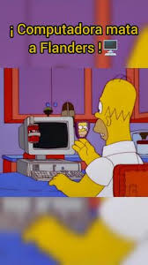
]
]

.pull-right[

En Bioinformática los lenguajes de programación más empleados para:

- Manipulación de datos son: **R, Python y Bash (shell)**. 
- Limpieza de datos provenientes de secuenciación: **Python y Bash (shell)**. 
- Generar graficas: **R y Python**

]

---

class: center, middle

`r fontawesome::fa("code", height = "3em")`
# Estructura de datos / Tipos de datos

---

## Existen 5 estructuras de datos en R

Las estructuras de datos son objetos que contienen datos. Cuando trabajamos con R, lo que estamos haciendo es manipular estas estructuras.

| Tipo        | Declaración de la variable       | Conversión       | Dimensiones  | Contenido               |
|-------------|----------------------------------|------------------|--------------|-------------------------|
| Vector      | c(), seq(), rep(), valorI:valorN; seq_len() | as.vector()      |  1           | homogénea               |
| Lists       | list()                           | as.list()        |  1*          | homogénea               |
| Matrix      | matrix(valores, nrow=x, ncol=y)  | as.matrix()      |  2           | heterogénea             |
| Dataframe   | dataframe()                      | as.dataframe()   |  2           | heterogénea             |

Tambien estan los `array` pero son poco usados en R.

Para conocer la estructura del archivo debes usar `str()`.

Una lista puede contener matrices en su interior, vectores, funciones, etc.

---

.center[
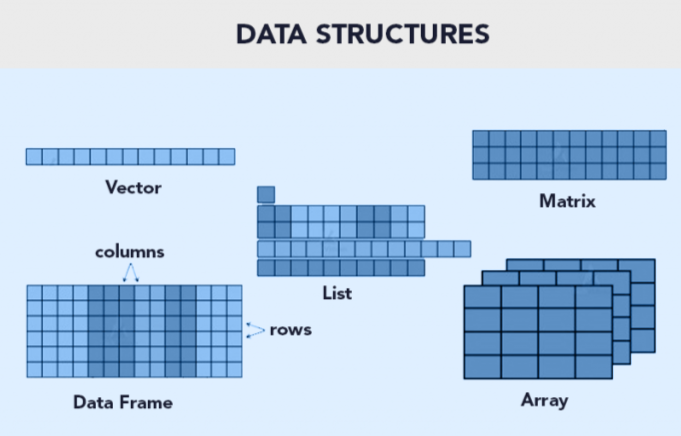
]

---

## Recordatorio: Clases de variables

| Clases    | Declaración de la variable    | Conversión de formato  |                   Reglas                                     |
|-----------|------------------------------|-------------------------|--------------------------------------------------------------|
| numeric   | `numeric()`                  | `as.numeric()`          | FALSE -> 0, TRUE -> 1; "1", "2", ... -> 1,2, ...; "A" -> NA  |
| integer   | `integer()`                  | `as.integer()`          | FALSE -> 0, TRUE -> 1; "1", "2", ... -> 1,2, ...; "A" -> NA  |
| double    | `double()`                   | `as.double()`           |                                                              |
| character | `character()`                | `as.character()`        |  1,2, ... -> "1", "2", ...; FALSE -> "FALSE"; TRUE -> "TRUE"|
| logical   | `logical()`                  | `as.logical()`          | 0 -> FALSE, other numbers -> TRUE; ("FALSE", "F") -> FALSE; ("TRUE", "T") -> TRUE, other character -> NA|
| factor    | `factor()`                   | `as.factor()`           |                                                             |

Si queremos saber la clase de la variable debemos usar `class()`, aunque tambien `str()` te dice esta información. 

> NOTA: `as.integer()` convierte los numeros a enteros. Ejemplo: as.integer(2.5) = 2. En cambio, `as.double()` permite que los numeros contengan decimales.

.left[.footnote[.black[
R for beginners, Página 24
]]]

---

## Recordatorio: Operadores

| Aritméticos              | Comparación               | Argumentos lógicos (Logical Operators)   |
|--------------------------|---------------------------|------------------------------------------|
| `+`  Adición / suma      | `<`  Menor que            | `!x`  - Not x (logical NOT)              |  
| `-`  Sustracción / resta | `>`  Mayor que            | `x & y` OR `x AND y` -  (logical AND)    |                
| `*`  Multiplicación      | `<=` Menor o igual que    | `x && y`  - identico                     |
| `/` OR %% División       | `>=`  Mayor o igual que   | `xor(x,y)`  Funcion OR                   |
| `^` OR ** Exponencial    | `==`  Igual a             | `%in%` pertenece a                       | 
| `%/%` División integral  | `!=`  Diferente de        |                                          |

Otra forma de escrir OR es `x | y` OR `x || y`.

.left[.footnote[.black[
R for beginners, Página 25
]]]

---
## Jerarquía de operaciones

En R, al igual que en matemáticas, las operaciones tienen un orden de evaluación definido.

Cuanto tenemos varias operaciones ocurriendo al mismo tiempo, en realidad, algunas de ellas son realizadas antes que otras y el resultado de ellas dependerá de este orden.


| Orden |  Operadores             | 
|-------|-------------------------|
| 1     |  `^`                    |
| 2     | `* /`                   |
| 3	    | `+ -`                   |
| 4	    | `< > <= >= == !=`       |
| 5     | `!`                     |
| 6	    | `&`                     |
| 7	    | OR                      |

---

class: center, middle

`r fontawesome::fa("code", height = "3em")`
# Trabajando en RStudio

---

## Cambiando el aspecto de RStudio

Podemos cambiar la forma en que se ve la aplicación desde **Editar > Preferencias > Apariencia**, escogemos el tema que nos guste y damos click en **Aplicar** y luego **OK** 

.center[
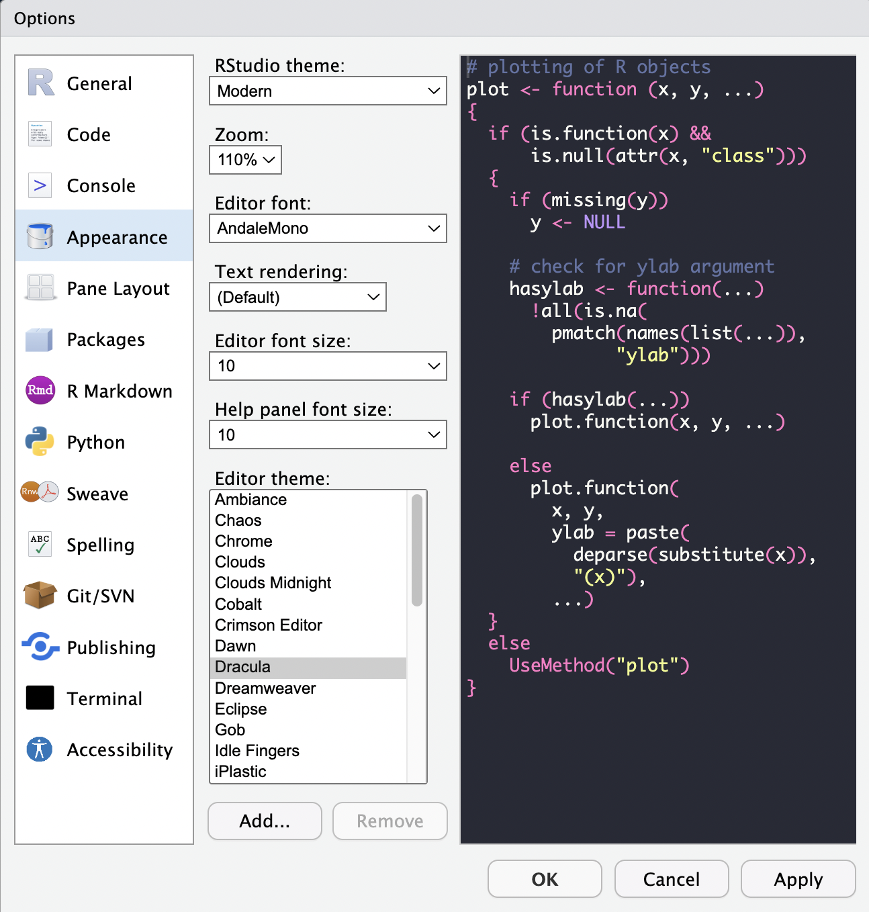
]

---

## Comenzando con R y RStudio: 1. R Project

Al comenzar a trabajar con R y RStudio, ya sea para crear un programa para un proyecto, crear una aplicación, presentación, blog, paquete, etc, es recomendado crear un **R project**.

Al crear un R project, se creará un folder en donde estarán todos los documentos, fotos, scripts, etc. que usaremos en ese projecto. Es una forma organizada y práctica de trabajar con R.

---

## ¿Cómo iniciamos un R project?

Vayamos en la parte superior al menú **Archivos > Nuevo Proyecto**.
.center[
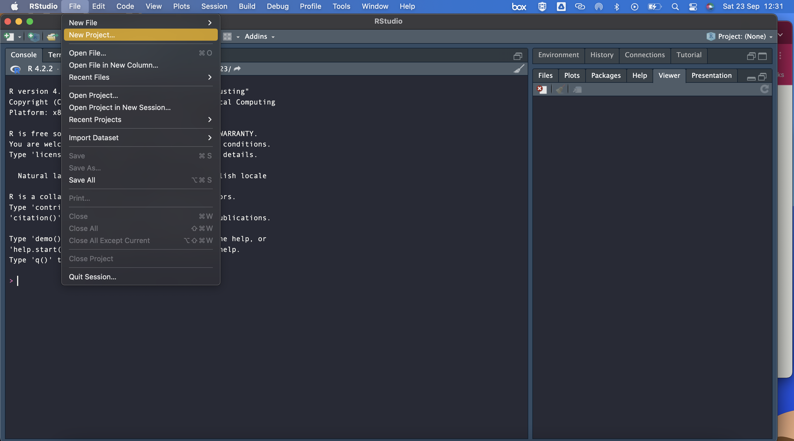]

---

## ¿Cómo iniciamos un R project?

Seleccionamos la opción de **Nuevo directorio**.
.center[
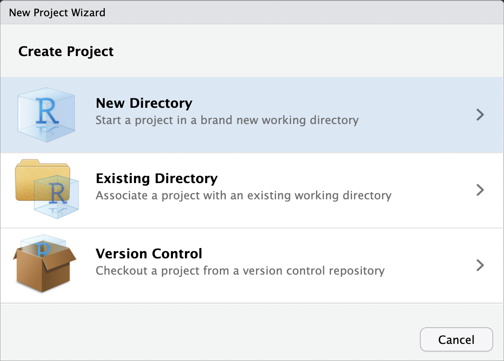]

---

## ¿Cómo iniciamos un R project?

Seleccionamos el tipo de projecto que vamos a iniciar, en nuestro caso **Nuevo proyecto**.
.center[
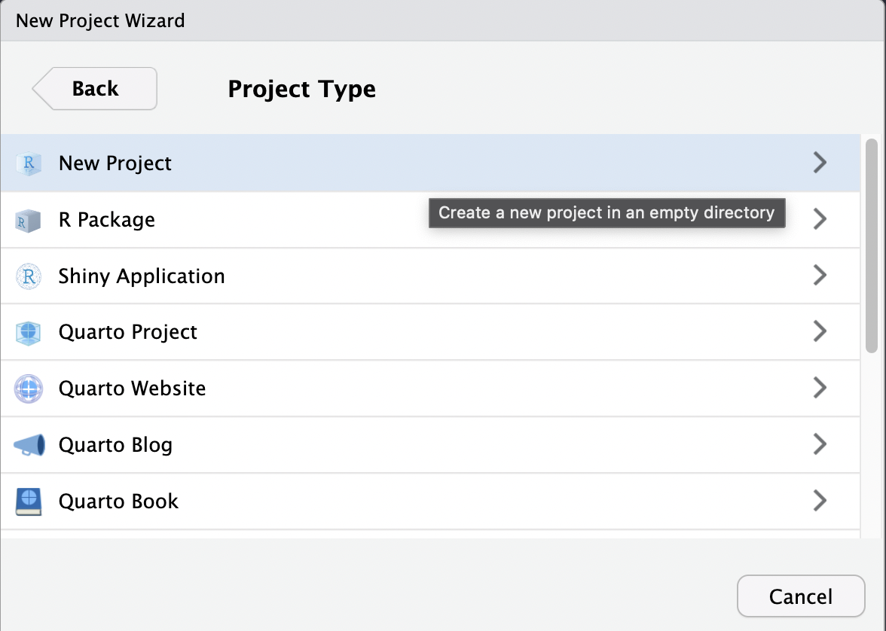]

---

## ¿Cómo iniciamos un R project?

Nombramos el folder que crearemos y seleccionamos en dónde queremos que se almacene. 
.center[
]

---

## ¿Cómo iniciamos un R project?

¡Felicidades, acabas de crear un R project! Si vamos al folder en donde creamos nuestro proyecto, podemos observar que se creó un archivo con terminación **Rproj**, este es un archivo que contiene la configuración específica para nuestro proyecto. 

Este archivo también establece como **directorio de trabajo** el folder en donde iniciamos el proyecto (puedes comprobarlo desde la consola de RStudio, escribiendo el comando `getwd()`). Esto es muy conveniente puesto que así podemos asegurarnos de que vamos a acceder a los archivos que estén exclusivamente en nuestro entorno de trabajo.

```{r}
getwd()
```

Cambiar directorio de trabajo

```{r eval = F}
setwd("/Users/sofiasalazar/nuevodirectorio") # Mac y Linux, iOS, ejemplo de Sofi
setwd("C:/Users/ecoss/OneDrive - CINVESTAV/Documentos/Posdoc_LIIGH/Clases_Cursos_Medicina_Guadalajara2023") # Windows
```

---

## Comenzando con nuestro proyecto: Crear un Rscript

Para comenzar a trabajar en un proyecto, necesitamos crear un archivo para escribir nuestro programa. Entra en **Archivo > Nuevo Archivo**.

Podemos ver que tenemos distintas opciones de archivos que podemos crear, en este caso vamos a crear nuestro primer Rscript.

.center[
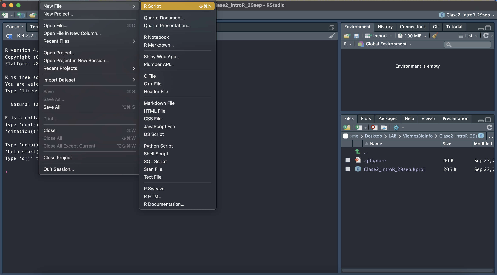]

---

## Crear un Rscript

**¿Qué es un Rscript?** Es simplemente un archivo de texto con las instrucciones de nuestro algoritmo escritas en el lenguaje de R. También contiene nuestros comentarios escritos con `#`.

Intenta escribir tu primer Rscript en el **editor**, copiando el siguiente algoritmo para realizar una suma:

```{r, eval = F}
a <- 2
b <- 3
suma = a + b
suma
```

Selecciona todo el código, después ve a la parte superior de la ventana del **editor** y da click en el botón **Run**. Enseguida de esto, en la **consola** se ejecutará tu código y podrás ver el siguiente resultado:

.left-col[
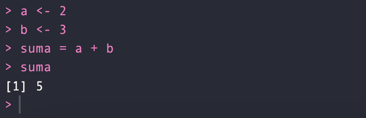]

.center-col[
También pueden ejecutar tu código línea por línea, poniendo tu cursor al principio o al final de la linea y presionando las teclas **Control + Enter** o **Command + Enter**.
]

---

## Crear un Rscript

**¿Qué es un Rscript?** Es simplemente un archivo de texto con las instrucciones de nuestro algoritmo escritas en el lenguaje de R. También contiene nuestros comentarios escritos con `#`.

Intenta escribir tu primer Rscript en el **editor**, copiando el siguiente algoritmo para realizar una suma:

```{r, eval = F}
a <- 2
b <- 3
suma = a + b
suma
```

Selecciona todo el código, después ve a la parte superior de la ventana del **editor** y da click en el botón **Run**. Enseguida de esto, en la **consola** se ejecutará tu código y podrás ver el siguiente resultado:

.left-col[
]

.center-col[
También pueden ejecutar tu código línea por línea, poniendo tu cursor al principio o al final de la linea y presionando las teclas **Control + Enter** o **Command + Enter**.
]

.right-col[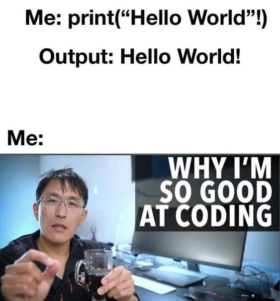]

---

class: center, middle

`r fontawesome::fa("code", height = "3em")`
# Buenas prácticas en programación

---

## Pasos 

.pull-left[
1. Análisis del problema / Definir el problema 

2. Diseño del algoritmo / Diseño del programa

3. Codificación / Escribir el código

4. Compilación y ejecución del programa

5. Verificación / Realizar pruebas

6. Depuración / Detectar los errores y corregirlos

7. Documentación
]

.pull-right[
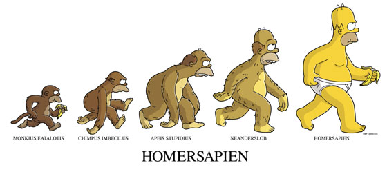
]

---

.center[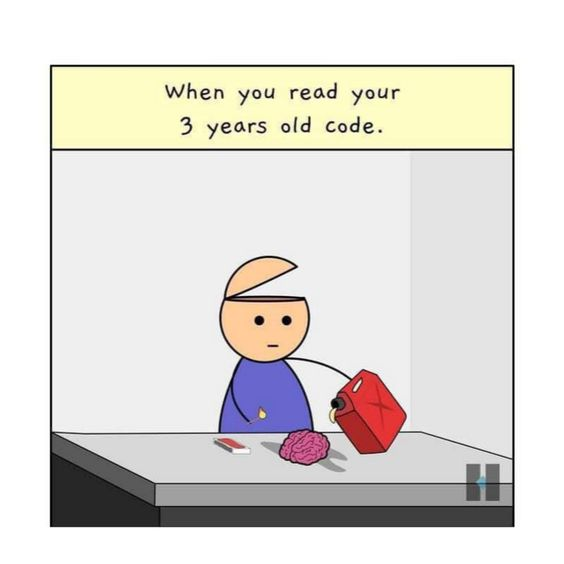

]

---

## Buenas prácticas de programación: Set up de tu trabajo

Es buena idea comenzar **todos** tus scripts con las mismas líneas de código que indiquen lo siguiente:

.content-box-gray[
- *Título de tu programa*
- *Autor (author)*: Su nombre
- *Fecha (date)*: Fecha de creación
- *Propósito general de tu programa (Description)*: ¿Para qué sirve el programa? Ej: El siguiente programa realiza la suma de dos numeros enteros a partir de la entrada del usuario y posteriormente la imprime en pantalla.
- *Usage* ¿Cómo se utiliza?
- *Paquetes (packages)*
- *Directorio de trabajo (Working directory)*: En que carpeta se encuentra tu datos y programa.
  - *Directorio de input*: aquí estan guardados los datos que vas a usar en el programa
  - *Directorio de output*: aquí es donde vas a guardar tus resultados
- *Argumentos (Arguments)*
  - *Información de entrada (Data Inputs)*: Ej: Solo numeros enteros (sin decimales).
  - *Información de salida (Outpus)*: Graficas, figuras, tablas, etc.
- Líneas en donde cargues los datos que vas a usar
]

---

## Buenas prácticas

1) Importar datos

```{r, eval = FALSE}
######
# Script de clase "Intro a R"
# Evelia Coss
# 9 de octubre 2023
#######

indir = "C:/Users/ecoss/OneDrive - CINVESTAV/Documentos/Posdoc_LIIGH/Clases_Cursos_Medicina_Guadalajara2023/IntroR_BasesDeDatos2023/data/"
outdir = "C:/Users/ecoss/OneDrive - CINVESTAV/Documentos/Posdoc_LIIGH/Clases_Cursos_Medicina_Guadalajara2023/IntroR_BasesDeDatos2023/"

infoCharacters <- read.csv(paste0(indir,"heroesInformation.csv"), na.strings = c("-", "-99")) # La opcion na.string nos permite sustituir valores - y -99 por NA
infoPowers <- read.csv(paste0(indir,"superHeroPowers.csv"))
infoStats <- read.csv(paste0(indir,"charactersStats.csv"), na.strings = "")
```

---

## Ejemplo: Función suma

Google: [Sum Function usage](https://www.rdocumentation.org/packages/base/versions/3.6.2/topics/sum)


.center[
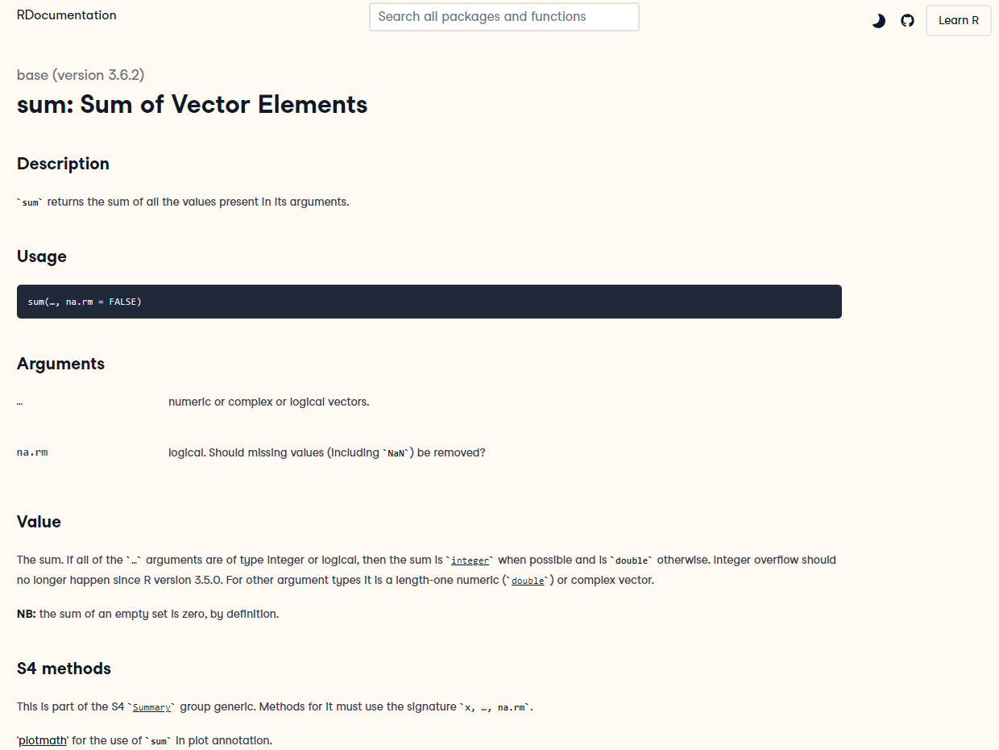

]

---

.center[


]

---

## Importar datos en R

Existen distintos tipos de formatos de datos que podemos ingresar a R para su análisis. Los principales son:

### A) Datos separados por un valor

Por ejemplo por comas (.csv), tab (.tsv) o espacios. Aunque la siguiente función puede leer por cualquier separador.

```{r, eval = F}
read.table("/path/dataset.csv", header = TRUE, delim = ",")
read.table("/path/dataset.tsv", header = TRUE, delim = "\t")
read.table("/path/dataset.", header = TRUE, delim = ",")
```

El parámetro header nos dice si considerar la primera fila como nombre de las variables.

También podemos leer un archivo .csv directamente:

```{r, eval = F}
read.csv("/path/dataset.csv")
```

---

## Datos en formato CSV

Archivos separados por comas. 

Este ejemplo fue obtenido del repositorio de Github de [Cosmoduende](dataset_shdb/charactersStats.csv).

.center[
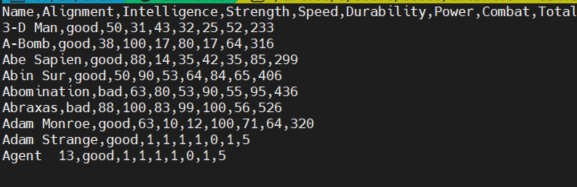]

---

## Datos en formato TSV

Archivo separado por tabuladores. 

Este ejemplo proviene de la base de datos de *Arabidopsis thaliana*, la planta modelo en el estudio de la genómica. Este archivo indica el tipo o característica del gen anotado en [Araport11](https://www.arabidopsis.org/download_files/Genes/Araport11_genome_release/Araport11_gene_type).

.center[
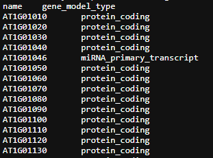]

---

## Se pueden cargar datos biológicos en formato TSV

- Formato de texto plano - [Araport11 Gene Type.txt](https://www.arabidopsis.org/download_files/Genes/Araport11_genome_release/Araport11_gene_type)
- [Formato GFF](https://genome.ucsc.edu/FAQ/FAQformat.html#format3): [Araport11_GFF3_genes_transposons.current.gff](https://drive.google.com/file/d/1EBl07-o6Ai2QvOzDwjbFmazipWK1Jgj2/view?usp=share_link) 
- [Formato GTF](https://genome.ucsc.edu/FAQ/FAQformat.html#format4): [Araport11_GTF_genes_transposons.current.gtf](https://drive.google.com/file/d/1XdQqVeaeB6Uz2AGFWRrUmKJ_9z2goYZX/view?usp=share_link) - 
- [Formato BED12](https://genome.ucsc.edu/FAQ/FAQformat.html) - [Araport11_pcoding_transcripts.bed](https://drive.google.com/file/d/1a3UzS6X_rQ8eyw0WllM8vR8DK4Aq3dR6/view?usp=share_link)

---

## Otros formatos

### B) Archivos tipo RData

Usualmente cargan todo el ambiente o varias variables

```{r, eval = F}
load("/path/ambiente.RData")
```

### C) Archivos tipo RDS

Se usan para cargar variables, usualmente muy pesadas

```{r, eval = F}
variable <- readRDS("/path/variable.RData")
```

---

## Buenas prácticas al finalizar tu programa

- **Guarda tu output**

```{r eval = F}
write.csv(datos_procesados, file = paste0(outdir, "datos_procesados.csv"))
save(variable, file = "/una/direccion/enTu/PC/variable.RData")
load("/una/direccion/enTu/PC/variable.RData") # ahora "variable" estara en tu ambiente
save.image(file = paste0(outdir, "sesionR_miPrograma.RData")
```

- **Especifica qué librerías utilizaste y qué versiones**

Cuando hacemos un programa, puede que en el futuro otras personas lo quieran utilizar, sin embargo, es probable que **las librerías que usaste en el momento que escribiste el programa se hayan actualizado.**

Es por eso que **al final de TODO programa que escribas, ejecutes y escribas el resultado de correr la siguiente línea.**

```{r, eval = F}
sessionInfo()
```

Puedes intentar correr este comando tú, lo que verás impreso en consola son todas las librerías instaladas en tu sesión de R, así como **la versión**. Entonces así, si alguien quiere reproducir tus resultados en algún momento, deberá instalar las mismas versiones de las librerías que tú utilizaste.

---

class: center, middle

`r fontawesome::fa("code", height = "3em")`
# Ejercicios

---

## Un ejercicio sencillo

Obtener perímetro de un rectángulo que mide 7 cm de ancho (altura, h) y 10 cm de largo (base, b). Genera su diagrama de flujo e imprime su resultado.

.center[
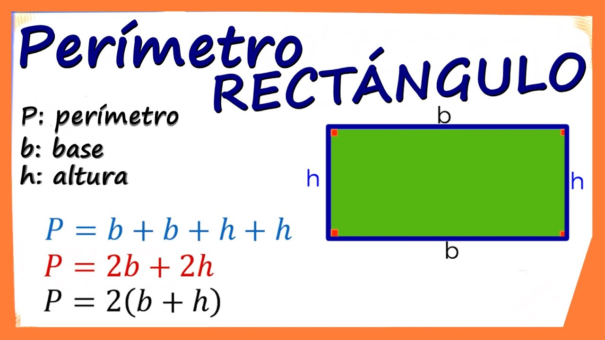
]

--

```{r}
# 1) Declarar las variables
b <- 10
h <- 7

P <- 2*(b + h) # 2) Realizar el calculo del perimetro
print(P) # 3) Mostrar el resultado.
```

---

### Cargar paquetes en R

```{r}
library("phyloseq")
library("ggplot2")      # graphics
library("readxl")       # necessary to import the data from Excel file
library("dplyr")        # filter and reformat data frames
library("tibble")       # Needed for converting column to row names
```

### Observar la ayuda de los paquetes

```{r, eval=FALSE}
?phyloseq    # Build phyloseq-class objects from their components.
?otu_table   # Build or access the otu_table.
?sample_data # Build or access sample_data
?tax_table   # Build or access the taxonomyTable
```

---

## Mini tutorial de `phyloseq`

Primero descarga los siguientes [datos](https://github.com/vaulot/R_tutorials/archive/master.zip) y descomprimelos en la misma carpeta donde creaste el R Project, dentro de una carpeta con el nombre `data/`.

El script completo se encuentra en `master/R_tutorial/phyloseq directory/Phyloseq_tutorial.Rmd`. Nosotros vamos a seguir el mini tutorial [MiniScript.R](https://github.com/EveliaCoss/Bioinformatica_en_R_CCM_2024/blob/main/MiniScript.R).

El tutorial completo se encuentra [aqui](https://vaulot.github.io/tutorials/Phyloseq_tutorial.html).

---

## Siempre toma lo mejor de los mejores y aprende de sus códigos

.center[
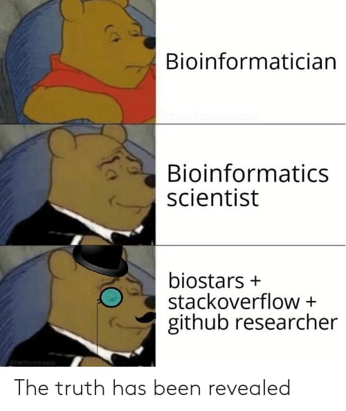

]

---

class: center, middle

`r fontawesome::fa("code", height = "3em")`

Gracias por tu atención, respira y coméntame tus dudas. 

